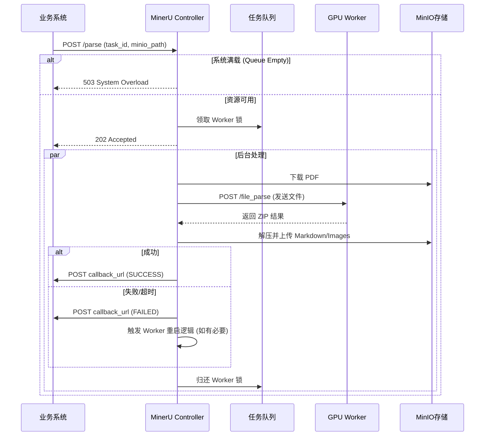

# MinerU Controller API 文档 v1.0

## 1\. 简介


  - **默认端口**: `58001`
  - **基础 URL**: `http://<服务器IP>:58001`
  - **数据格式**: JSON

-----

## 2\. 接口详情

### 2.1 提交解析任务 (生产环境)

**描述**: 提交一个 PDF 解析任务。系统会将任务放入队列，分配空闲 GPU Worker 处理。该接口是非阻塞的，立即返回任务 ID，处理结果通过回调 (Webhook) 通知。

  * **URL**: `/parse`
  * **Method**: `POST`
  * **Content-Type**: `application/json`

#### 请求参数 (Body)

| 参数名 | 类型 | 必填 | 说明 | 示例 |
| :--- | :--- | :--- | :--- | :--- |
| `task_id` | string | 是 | 全局唯一的任务 ID (建议 UUID) | `"task_123456"` |
| `paper_id` | string | 是 | 论文/文件 ID，用于内部文件名生成 | `"paper_abc"` |
| `input_pdf` | string | 是 | MinIO 中的输入文件路径 (`Bucket/Path`) | `"inputs/2023/AI_Paper.pdf"` |
| `output_md` | string | 是 | MinIO 中的输出 Markdown 路径 | `"outputs/2023/AI_Paper.md"` |
| `callback_url` | string | 是 | 任务完成/失败后，服务端 POST 通知的地址 | `"http://your-backend.com/api/callback"` |
| `parse_method` | string | 否 | 解析模式: `auto`, `ocr`, `txt` (默认 `auto`) | `"auto"` |

#### 响应示例 (成功)

**Status Code**: `202 Accepted`

```json
{
  "message": "Task accepted",
  "task_id": "task_123456"
}
```

#### 响应示例 (失败 - 系统满载)

**Status Code**: `503 Service Unavailable`

```json
{
  "detail": "System overload. Please try again later."
}
```

-----

### 2.2 任务回调通知 (Webhook)

**描述**: 当任务处理完成（成功、失败或超时）时，Controller 会主动向请求中提供的 `callback_url` 发送 POST 请求。**你需要实现此接口来接收结果。**

  * **Direction**: Controller -\> 你的业务服务器
  * **Method**: `POST`
  * **Content-Type**: `application/json`

#### 回调 Body 定义

| 参数名 | 类型 | 说明 |
| :--- | :--- | :--- |
| `task_id` | string | 原样返回提交时的任务 ID |
| `paper_id` | string | 原样返回提交时的 paper\_id |
| `status` | string | 状态枚举: `SUCCESS`, `FAILED`, `TIMEOUT` |
| `md_key` | string | (仅成功时) MinIO 上的 Markdown 文件完整路径 |
| `error_message` | string | (仅失败/超时时) 错误原因描述 |
| `execution_time_ms` | int | 任务实际消耗时间 (毫秒) |

#### 回调示例 (成功)

```json
{
  "task_id": "task_123456",
  "paper_id": "paper_abc",
  "status": "SUCCESS",
  "md_key": "outputs/2023/AI_Paper.md",
  "error_message": null,
  "execution_time_ms": 4500
}
```

#### 回调示例 (失败/超时)

```json
{
  "task_id": "task_123456",
  "paper_id": "paper_abc",
  "status": "FAILED",  // 或 "TIMEOUT"
  "md_key": null,
  "error_message": "Worker Connection Error",
  "execution_time_ms": 30000
}
```

-----

### 2.3 直接上传测试 (调试用)

**描述**: 直接上传 PDF 文件并同步等待结果，返回解析后的 ZIP 压缩包。**注意：此接口会占用 Worker 资源，仅建议用于开发调试，不支持高并发。**

  * **URL**: `/test/direct_parse`
  * **Method**: `POST`
  * **Content-Type**: `multipart/form-data`

#### 请求参数 (Form Data)

| 参数名 | 类型 | 必填 | 说明 |
| :--- | :--- | :--- | :--- |
| `file` | File | 是 | PDF 文件二进制流 |

#### 响应 (成功)

  * **Status Code**: `200 OK`
  * **Content-Type**: `application/zip`
  * **Headers**: `Content-Disposition: attachment; filename*=utf-8''result_filename.zip`
  * **Body**: 二进制 ZIP 文件 (包含 .md, images, .json 等)

#### 响应 (失败)

  * **Status Code**: `500` 或 `503` (满载)
  * **Body**: JSON 错误信息

-----

### 2.4 健康检查

**描述**: 查看当前 GPU Worker 集群的运行状态、显卡占用情况及队列积压情况。

  * **URL**: `/health`
  * **Method**: `GET`

#### 响应示例

```json
{
  "status": "running",
  "free_workers": 1,        // 当前空闲可用的 Worker 数量
  "total_workers": 2,       // 总 Worker 数量
  "details": [
    {
      "url": "http://127.0.0.1:6000",
      "pid": 12345,
      "status": "idle",           // 状态: idle, busy: {task_id}, starting, dead
      "system_alive": true        // 系统进程是否实际存活
    },
    {
      "url": "http://127.0.0.1:6001",
      "pid": 12346,
      "status": "busy: task_999",
      "system_alive": true
    }
  ]
}
```

-----

## 3\. 业务流程图

